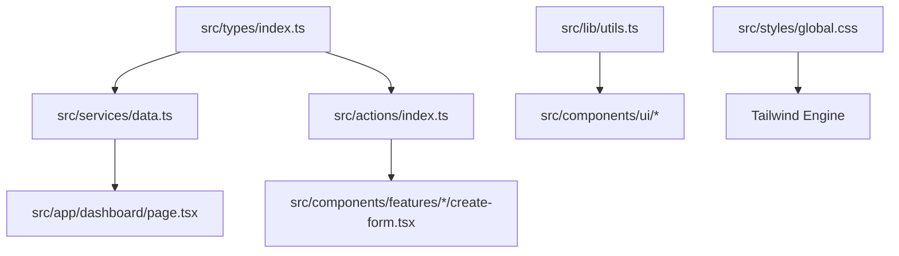

# CODEBASE.md - Agent Intelligence

> Project-specific knowledge, file dependencies, and architectural constraints.

---

## 🏗️ System Architecture

This is a Next.js 15+ application built with the App Router, utilizing Tailwind CSS v4 and NextAuth.js v5.

### Core Directory Structure

- `src/app/`: Route segments and layouts.
- `src/components/`:
  - `ui/`: Base shadcn/ui components.
  - `features/`: Feature-specific logic (Invoices, Customers, Dashboard).
  - `landing/`: Marketing page components.
- `src/lib/`: Core utilities and shared helpers.
- `src/services/`: Data fetching layer (direct SQL queries via `postgres` package).
- `src/actions/`: Server Actions for data mutations and authentication.
- `src/types/`: Centralized TypeScript definitions.
- `e2e/`: Playwright end-to-end testing suite.

---

## 🔗 File Dependencies & Data Flow

### 1. Data Layer

- **Source of Truth**: `src/types/index.ts` defines all shared data models (User, Customer, Invoice, etc.).
- **Fetching**: `src/services/data.ts` exports async functions for server-side data fetching.
- **Mutations**: `src/actions/index.ts` handles all "use server" logic.

### 2. Styling Dependency

- **Tailwind v4**: Configuration is CSS-based in `src/styles/global.css`. **Do not look for `tailwind.config.ts`.**
- **Utility**: All components use `cn()` from `@/lib/utils` for class merging.

### 3. Authentication

- `src/auth.ts`: Main Auth.js initialization.
- `src/auth.config.ts`: Middleware and route protection logic.
- `src/proxy.ts`: Middleware entry point for route filtering.

---

## 🛠️ Infrastructure & Tech Stack

| Domain        | Technlogy            | Notes                                       |
| :------------ | :------------------- | :------------------------------------------ |
| Framework     | Next.js (App Router) | React Server Components (RSC) preferred.    |
| Styling       | Tailwind CSS v4      | Uses `@theme` in CSS. No config file.       |
| UI Components | shadcn/ui            | Radix UI + Lucide React.                    |
| Database      | PostgreSQL           | Managed via `postgres` driver (direct SQL). |
| Auth          | NextAuth.js v5       | Beta version.                               |
| Testing       | Jest + Playwright    | Unit vs E2E separate environments.          |

---

## 📜 Development Standards

### 1. Naming Conventions

- **Components**: PascalCase (e.g., `RevenueChart.tsx`).
- **Files/Folders**: kebab-case (e.g., `latest-invoices.tsx`, `auth-config.ts`).
- **Types**: PascalCase.

### 2. Constraints & Rules

- **Server Actions**: Always kept in `src/actions/index.ts` or scoped action files with "use server".
- **Database Access**: Perform SQL queries only in `src/services/` or `src/actions/`. Never in components.
- **Tailwind v4**: Use OKLCH colors and semantic variables defined in `src/styles/global.css`.
- **Testing**:
  - Unit tests (`*.test.tsx`) live alongside components.
  - E2E specs live in `/e2e`.
  - Jest is configured to ignore the `/e2e` folder to prevent runtime errors.

---

## ⚠️ Critical Path Map

